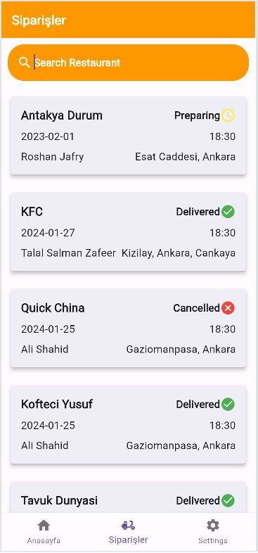
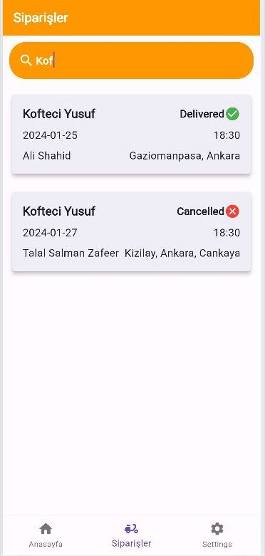

# New Features Implemented

## Verification Page
A whole new verificaion_page.dart class is implemented to design the page on which when the basla button is pressed the navigator takes the user to the orders page.

This can be found under /lib/pages/verification_page.dart 

The verification page design can be found under the path lib/pages/verification_page.dart
On the main.dart when application runs the verification page is showed.

 

## Images Added 
Certain images are added for the logo import from figma to design the page.
They can be found under lib/images/

## Updated pubsec.yaml 
The file has been adjusted to add the images and add the fonts from the figma file.
line 34-35 has the added packages

## Sizing issue fixed for the mobile devices
The overflow of pixels issues has been fixed by resizing certain elements

## Fade In & Slide from left animation added to the verification page
Visibility Detector used and animation to slide the text as the first page loads.
This can be found under /lib/pages/verification_page.dart 

## On Seach Feature Implemented
User can filter the search for resturants using the search bar implemented which can be found under 

From line 191 - 237

 

 

